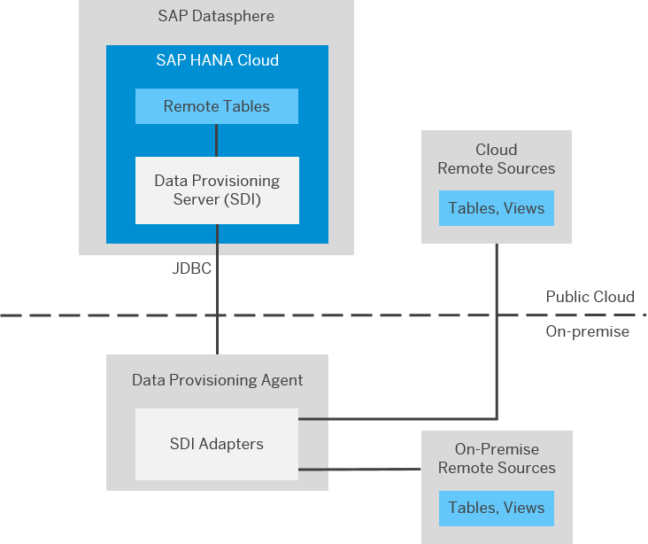

Para crear las conexiones desde DSP hacia las BBDD de AySA deben estar bien configurados el DPA (Data Provisioning Agent) y el CC (Cloud Connector).

Remote Tables: alcanza con DPA

Replication Flows

Data Flows: necesario Cloud Connector

Información oficial para conexión con Microsoft SQL Server: [link](https://help.sap.com/docs/SAP_DATASPHERE/be5967d099974c69b77f4549425ca4c0/a13c8abb328f45be891599c9cc76fb91.html).

Manual oficial Administering SAP Datasphere: [link](https://help.sap.com/doc/653e215be007410e80e64dfc537ef2d0/cloud/en-US/DWC_Administering_DWC.pdf).

## Esquema conexión DSP - On Premise

## Conexión SQL Server con Remote Tables habilitadas

### Configuración BBDD

Creación de Usuario para la conexión

General: Usuario en el servidor con Autenticación por SQL (solo opción “Enforce password policy”).

Server Rol: public

User Mapping:  las bases a conectar con opción public y db_datareader 

### Configuración DPA

### Configuración DSP

Tipo de conexión

Tipo: Microsoft SQL Server

#### Propiedades de la conexión

Server Name: servidor.aysa.ad (ejemplo: bodbrep)

Puerto: 1433 (ejemplo para bodbrep el estándar de sql)

Database Name: nombre de la base de datos a conectar

Version: Microsoft SQL Server 2019

Use Cloud Connector: false

Use SSL: false

Credentials User Name and Password: creados en la BBDD

Data Provisioning Agent: SADPA10

Resto de los campos dejar como están y completar finalmente  el nombre de la conexión SERVIDOR_BBDD