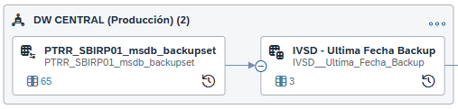

# Objetivo

Para garantizar una visibilidad clara y automática sobre la **fecha de última actualización de los datos**, especialmente en las réplicas alojadas en el servidor de backups restaurados, se propuso incorporar un **campo visible que indique esta información de manera consistente y transversal**.

# Solución Planteada

## Infraestructura y Origen de los Datos

Los datos de los backups restaurados se encuentran en la base de datos `msdb` del servidor **SBIRP01**, específicamente en la tabla `backupset`.

Para centralizar esta información, se generó una conexión hacia dicha base y se importó la tabla al entorno **Central PRD**, quedando disponible bajo el nombre:\
`PTRR_SBIRP01_msdb_backupset`.

## Centralización de la Información

Con la tabla ya disponible en Central PRD, se creó una **vista parametrizada** llamada `IVSD_Ultima_Fecha_Backup`. Esta vista recibe como parámetro el nombre de una base de datos y retorna el **último registro correspondiente a la fecha más reciente de backup** para dicha base.

Tanto la tabla como la vista fueron generadas en el espacio **Central PRD**, y pueden ser utilizadas por otros espacios mediante la generación de una **nueva capa basada en esta vista**.

## Utilización de la vista

Dentro del espacio al cual se compartió la vista y de la cual se desean conocer la ultima fecha de actualización de los datos de las bases de origen se debe generar una nueva vista: (ej para Loyal) IVSD__Ultima_Fecha_Backup_Loyal la cual llama a la vista mencionada anteriormente y obtiene los datos para sus bases especificas.

Esta vista debe ser replicada al inicio de la task chain de la cual se toman los datos y de esta manera quedará grabado en su replica la fecha a la cual se encuentran los datos en el datawarehouse cloud.