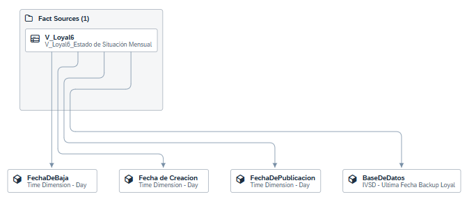

# Objetivo

Para garantizar una visibilidad clara y automática sobre la **fecha de última actualización de los datos**, especialmente en las réplicas alojadas en el servidor de backups restaurados, se propuso incorporar un **campo visible que indique esta información de manera consistente y transversal**.

# Solución Planteada

## Infraestructura y Origen de los Datos

Los datos de los backups restaurados se encuentran en la base de datos `msdb` del servidor **SBIRP01**, específicamente en la tabla `backupset`.

Para centralizar esta información, se generó una conexión hacia dicha base y se importó la tabla al entorno **Central PRD**, quedando disponible bajo el nombre:\
`PTRR_SBIRP01_msdb_backupset`.

## Centralización de la Información

Con la tabla ya disponible en Central PRD, se creó una **vista parametrizada** llamada `IVSD_Ultima_Fecha_Backup`. Esta vista recibe como parámetro el nombre de una base de datos y retorna el **último registro correspondiente a la fecha más reciente de backup** para dicha base.

Tanto la tabla como la vista fueron generadas en el espacio **Central PRD**, y pueden ser utilizadas por otros espacios mediante la generación de una **nueva capa basada en esta vista**.

## Uso de la Vista

En el espacio donde se haya compartido la vista, y desde donde se desea conocer la fecha de última actualización de los datos de origen, se debe crear una nueva vista (por ejemplo, para _Loyal_: `IVSD_Ultima_Fecha_Backup_Loyal`). Esta vista consulta la vista centralizada y recupera los datos correspondientes a sus bases específicas.

Esta vista debe ser ejecutada al inicio de la _task chain_ que alimenta las réplicas, de modo que la fecha de actualización quede registrada en la propia réplica dentro de SAP Data Warehouse Cloud.

Se recomienda que esta vista sea del tipo **Dimensión**, y que sea utilizada en la vista y modelo analítico como **Asociación**, para evitar la duplicación del dato en cada registro. La vista debe incluir una columna que identifique el origen de los datos (nombre de la base de datos), la cual se usará como clave de mapeo para asociarla con los datos del modelo principal.

