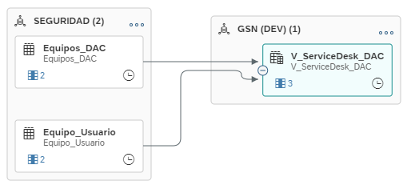
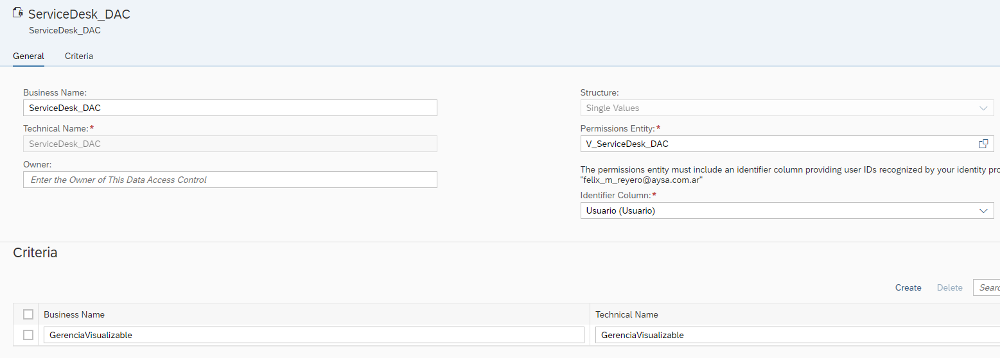
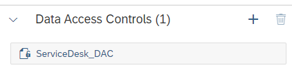
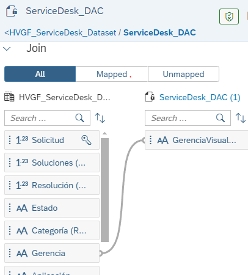
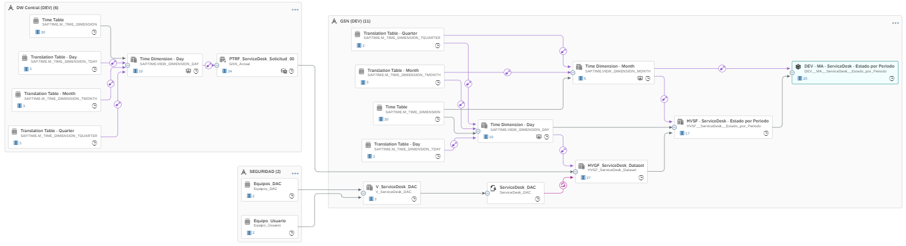

Explicación utilizando ejemplo de implementación para Tablero ServiceDesk.

En el espacio de Seguridad creé una carpeta para guardar la información de ServiceDesk, ambas están compartidos con el espacio para poder ser utilizadas desde él.

- Tabla Local: Equipo_Usuario
  * Mapeo el o los equipos (clave doble) a los usuarios (mail dado de alta en DS)
    * Equipo
    * Usuario
- Tabla Local: Equipos_DAC
  * Mapeo el o los equipos (clave doble) a los valores de gerencias que quiero filtrar (escrito de la misma manera que la tabla a filtrar)
    * Equipo
    * GerenciaVisualizable

Se pueden tener distintas según ambientes (todo depende lo que convenga o corresponda) ya que luego se crea una vista a parte en el espacio correspondiente.

En el espacio de GSN_DEV (tablero SD DEV) me creé una carpeta llamada DAC y dentro creé una vista muy simple que lo único que hace es unir en un solo lugar las tablas mencionadas arriba (si tuviera varias ahí juega poder elegir):

* V_ServiceDesk_DAC
  * {width=343 height=156}

Luego creé el DAC propiamente dicho donde elijo el nombre, le marco la vista de la cual va a tomar los permisos (V_ServiceDesk_DAC), el identifier column (la columna con el mail del usuario) y el criterio por el cual va a filtrar que en nuestro caso es la GerenciaVisualizable:

* 

Luego voy a la vista donde se originan los datos. En mi caso es en la HVGF_ServiceDesk_Dataset que es donde mapeo las mesas a una gerencia y genero su columna. Dentro de ella abajo de las asociations le agrego la DAC

* {width=313 height=90}

Y le mapeo la Gerencia (columna de HVG) a la del DAC (GerenciaVisualizable):

* 

Hago el deploy y listo:

