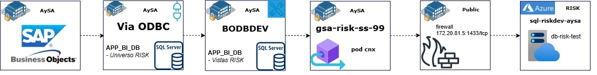

# Infraestructura y obtención de datos

La conexión presenta una dificultad adicional, ya que la base de datos se encuentra alojada en la nube de Azure. Sin embargo, se logró establecer la conexión con la base de datos **db-risk-test** (ubicada en el servidor **sql-riskdev-aysa**) reutilizando la configuración previamente implementada para obtener datos desde Superset.

A pedido de Alejandro, se solicitó una regla de firewall que permitiera la salida hacia la base de datos en Azure (dev). Dentro del servidor **gsa-risk-ss-99**, uno de los tres contenedores fue configurado específicamente para redireccionar el tráfico utilizando dicha regla. Este contenedor actúa como puente, redireccionando la conexión a Azure y exponiéndola localmente.

Finalmente, se implementó un port forwarding desde el servidor para exponer el puerto correspondiente, permitiendo que la base de datos pueda ser consumida desde dentro de AySA como si se tratara de una base de datos interna. 

