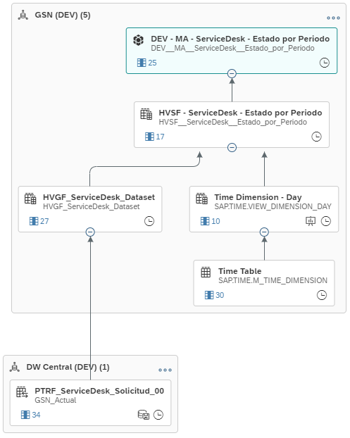

## Arquitectura General

### Arquitectura Interna DSP

## Flujo -- EN PROCESO (Se documenta ambiente DEV cambios post división gerencias)

### PTRF_ServiceDesk_Solicitud_00
Se toma la tabla remota de origen PTRF_ServiceDesk_Solicitud_00 (SASQL01_DBSD_GSN: "dbo"."GSN_Actual$") y se calendariza la carga para tenerla en memoria los miércoles luego del volcado por parte de Sistemas Colaborativos.

La tabla de origen tiene asociaciones en los campos Fecha de creación, Fecha de solución, Fecha de cierre, Fecha de rechazo con las tablas de tiempo de SAP. No tiene filtros de origen y su clave es "Solicitud".

### HVGF_ServiceDesk_Dataset

#### Gerencia
- **Descripción**: Asigna una gerencia basada en el campo "Mesa de ayuda (Raíz)".
- **Modificación**: Utiliza un `CASE` para mapear distintos valores de "Mesa de ayuda (Raíz)" a categorías específicas.
- **Detalle del mapeo**:
  - '[DESAFECTADA] DTI-GSN - Estudios Socioterritoriales' → 'Sistemas de Usuario'
  - 'DTI-GSN - Desarrollo GIS' → 'Sistemas de Usuario'
  - '[DESAFECTADA] DTI-GSN - Soporte CAD y Modelizadores' → 'Sistemas de Usuario'
  - 'DTI-GSN - Business Intelligence' → 'Sistemas de Usuario'
  - 'DTI-GSU - SAP Gestión de Cobro' → 'Sistemas de Usuario'
  - 'DTI-GSU - SAP Contabilidad y Recaudación' → 'Sistemas de Usuario'
  - 'DTI-GSU - SAP Facturación' → 'Sistemas de Usuario'
  - 'DTI-GSU - SAP Solución de Impresión' → 'Sistemas de Usuario'
  - 'DTI-GSU - EAyP' → 'Sistemas de Usuario'
  - 'DTI-GSU - Servicios Web (Sist. de Usuario)' → 'Sistemas de Usuario'
  - 'DTI-GSU - Servicios Web - ComDigital' → 'Sistemas de Usuario'
  - 'DTI-GSU - SAP Atención al Usuario y Datos Técnicos' → 'Sistemas de Usuario'
  - 'DTI-GSU - TMDC' → 'Sistemas de Usuario'
  - 'DTI-GSU - Desarrollo SAR y SIS' → 'Sistemas de Usuario'
  - 'DTI-GSA - Soporte Dominios Especiales' → 'Sistemas Administrativos'
  - 'DTI-GSA - Servicios Web (RRHH)' → 'Sistemas Administrativos'
  - 'DTI-GSA - Soporte Hyperion' → 'Sistemas Administrativos'
  - 'DTI-GSA - Soporte Oracle EBS' → 'Sistemas Administrativos'
  - 'DTI-GSA - Soporte People Soft, Denarius y DTA' → 'Sistemas Administrativos'
  - 'DTI-GSN - Gestión de Mantenimiento de Activos' → 'Sistemas Administrativos'
  - 'DTI-GSN - Gestión de la Calidad' → 'Sistemas Administrativos'
  - '[DESAFECTADA] DTI-GSN - Sistemas de Calidad - PPE' → 'Sistemas Administrativos'
  - 'DTI-GSN - Producción GIS' → 'A definir'
  - Otros valores → 'Sin asignar'

#### CALMONTH_Creacion
- **Descripción**: Crea un campo que representa el mes y año de la fecha de creación.
- **Modificación**: Usa `CONCAT` y `SUBSTRING` para combinar el año y mes de "Fecha de creación" en el formato "YYYYMM".

#### Rechazado
- **Descripción**: Indica si la solicitud ha sido rechazada.
- **Modificación**: Utiliza un `CASE` para verificar si "Fecha de rechazo" no es nulo, devolviendo TRUE si es así, y FALSE en caso contrario.

#### Fecha_de_Procesado
- **Descripción**: Determina la fecha más temprana entre "Fecha de cierre" y "Fecha de rechazo".
- **Modificación**: Utiliza un `CASE` para comparar las fechas y devolver la menor de las dos. Si una de ellas es nula, devuelve la otra. Si ambas son nulas, devuelve NULL.

#### CALMONTH_Procesado
- **Descripción**: Crea un campo que representa el mes y año de la fecha de procesado.
- **Modificación**: Usa `CONCAT` y `SUBSTRING` en combinación con el `CASE` de "Fecha_de_Procesado" para obtener el año y mes en el formato "YYYYMM".

#### Clasificacion
- **Descripción**: Clasifica las solicitudes basadas en el campo "Categoría (Nivel 3)".
- **Modificación**: Utiliza un `CASE` para mapear valores específicos de "Categoría (Nivel 3)" a categorías más amplias.
- **Detalle del mapeo**:
  - '[DESAFECTADO] Hacer una pregunta' → 'Hacer una pregunta'
  - 'Hacer una pregunta' → 'Hacer una pregunta'
  - 'Sin subcategoría' → 'Hacer una pregunta'
  - '[DESAFECTADO] Informar un incidente' → 'Informar un incidente'
  - 'Despliegue GIS Web' → 'Informar un incidente'
  - 'Maximo' → 'Informar un incidente'
  - 'Sistema GIS' → 'Informar un incidente'
  - '[DESAFECTADO] Realizar un pedido' → 'Realizar un pedido'
  - '[DESAFECTADO] Solicitar accesos o permisos' → 'Realizar un pedido'
  - '[DESAFECTADO] Solicitar cambio de destinatarios de reportes' → 'Realizar un pedido'
  - '[DESAFECTADO] Solicitar la instalacion' → 'Realizar un pedido'
  - '[DESAFECTADO] Solicitar un reporte' → 'Realizar un pedido'
  - 'Accesos y permisos (DOR y DTyDT)' → 'Realizar un pedido'
  - 'Solicitar desbloqueo de usuario' → 'Realizar un pedido'
  - '[DESAFECTADO] Requerir un cambio' → 'Requerir un cambio'
  - Otros valores → Valor original de "Categoría (Nivel 3)"

#### Solucion_Dias
- **Descripción**: Convierte el tiempo de solución de minutos a días hábiles.
- **Modificación**: Divide el valor de "Soluciones (Tiempo hábil de última solución)" por 60 para obtener horas y luego por 8 para convertirlo a días hábiles.

### HVSF - ServiceDesk - Estado por Periodo:

#### Campos Seleccionados y Transformaciones

- **CALMONTH**: 
  - **Descripción**: Mes y año de referencia del calendario.
  - **Fuente**: `MS.CALMONTH` del dataset temporal.

- **Solicitud**:
  - **Descripción**: Identificador de la solicitud.
  - **Fuente**: Campo `s."Solicitud"` del dataset de solicitudes.

- **Gerencia**:
  - **Descripción**: Gerencia a la que pertenece la solicitud.
  - **Fuente**: Campo `s."Gerencia"` del dataset de solicitudes.

- **Mesa de ayuda (Raíz)**:
  - **Descripción**: Categoría principal de la mesa de ayuda.
  - **Fuente**: Campo `s."Mesa de ayuda (Raíz)"` del dataset de solicitudes.

- **Aplicacion**:
  - **Descripción**: Aplicación relacionada con la solicitud.
  - **Fuente**: Campo `s."Aplicacion"` del dataset de solicitudes.

- **Tipo**:
  - **Descripción**: Categoría de nivel 3 en un formato de título (primera letra de cada palabra en mayúscula).
  - **Transformación**: Usa `INITCAP` para capitalizar el campo `s."Categoría (Nivel 3)"`.

- **Subtipo**:
  - **Descripción**: Tipo de solicitud.
  - **Fuente**: Campo `s."Tipo"` del dataset de solicitudes.

- **Calificación**:
  - **Descripción**: Calificación de la solicitud si fue procesada en el mes correspondiente.
  - **Transformación**: Usa un `CASE` para devolver la calificación solo si `MS."CALMONTH"` es igual a `s."CALMONTH_Procesado"`. Se convierte a tipo DOUBLE.

- **Prioridad**:
  - **Descripción**: Prioridad de la solicitud.
  - **Fuente**: Campo `s."Prioridad"` del dataset de solicitudes.

- **En espera de**:
  - **Descripción**: Persona o departamento de quien se espera una acción.
  - **Fuente**: Campo `s."En espera de"` del dataset de solicitudes.

- **Fecha de creación**:
  - **Descripción**: Fecha en que se creó la solicitud.
  - **Fuente**: Campo `s."Fecha de creación"` del dataset de solicitudes.

- **Fecha_de_Procesado**:
  - **Descripción**: Fecha en que se procesó la solicitud.
  - **Transformación**: Usa un `CASE` para devolver la fecha solo si `MS."CALMONTH"` es igual a `s."CALMONTH_Procesado"`. Se convierte a tipo DATE.

- **Solucion_Dias**:
  - **Descripción**: Tiempo de solución en días hábiles.
  - **Transformación**: Usa un `CASE` para devolver los días de solución solo si `MS."CALMONTH"` es igual a `s."CALMONTH_Procesado"`. Se convierte a tipo DOUBLE.

- **Ingresado**:
  - **Descripción**: Indica si la solicitud fue ingresada en el mes correspondiente.
  - **Transformación**: Usa un `CASE` para devolver 1 si `MS."CALMONTH"` es igual a `s."CALMONTH_Creacion"`, de lo contrario devuelve 0.

- **Pendiente**:
  - **Descripción**: Indica si la solicitud está pendiente en el mes correspondiente.
  - **Transformación**: Usa un `CASE` para devolver 1 si `MS."CALMONTH"` está entre `s."CALMONTH_Creacion"` y `s."CALMONTH_Procesado"`, o si `s."CALMONTH_Procesado"` es NULL. De lo contrario, devuelve 0.

- **Procesado**:
  - **Descripción**: Indica si la solicitud fue procesada en el mes correspondiente.
  - **Transformación**: Usa un `CASE` para devolver 1 si `MS."CALMONTH"` es igual a `s."CALMONTH_Procesado"`, de lo contrario devuelve 0.

- **Rechazado**:
  - **Descripción**: Indica si la solicitud fue rechazada en el mes correspondiente.
  - **Transformación**: Usa un `CASE` para devolver 1 si `MS."CALMONTH"` es igual a `s."CALMONTH_Procesado"` y `s."Rechazado"` es TRUE. De lo contrario, devuelve 0.

#### Fuentes de Datos y Uniones
- **Tabla temporal de calendario** (`SAP.TIME.VIEW_DIMENSION_DAY` alias `MS`):
  - Contiene información sobre los meses y años.

- **Dataset de solicitudes** (`HVGF_ServiceDesk_Dataset` alias `s`):
  - Contiene detalles de las solicitudes.

#### Condiciones de Filtrado
- La vista solo incluye registros donde `MS."CALMONTH"` está entre enero de 2024 (202400) y el mes de creación más reciente de las solicitudes.

### MA - ServiceDesk - Estado por Periodo

El modelo analítico tiene finalmente los siguientes indicadores: Calificación, Ingresados, Pendientes, Performance Pendientes, Performance Procesados, Procesados, Rechazados, Solucion_Dias y Tasa de Rechazos; y las siguientes dimensiones: Aplicacion, Calendar Month, En espera de, Fecha de creación, Fecha_de_Procesado, Gerencia, Mesa de Ayuda, Prioridad, Rechazado, Solicitud, Subtipo y Tipo.

## Schedule

