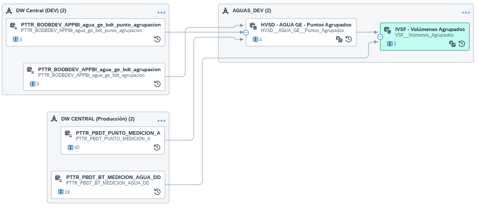

## Modelado Puntos de Medición Agrupados

En APP BI se crearon dos tablas:

* **agua_ge_bdt_agrupacion**: Contiene grupos de agrupaciones (ej: PSM Producción es Id 1)
* **agua_ge_bdt_punto_agrupacion**: Relaciona puntos de la BDT con las agrupaciones (ej: EP1IMPQ1 con agrupación Id 1)

Estas tablas son consumidas desde la vista DSP: '**HVSD AGUA GE Puntos Agrupados**' donde cruza con **PUNTO_MEDICION_A** de BDT para traer los id de los puntos en la base.

Finalmente desde 'IVSF - Volúmenes Agrupados' se consume la mencionada vista '**HVSD AGUA GE Puntos Agrupados**' en conjunto con '**BT_MEDICION_AGUA_DD**' de la BDT para traer los valores sumarizados por mes para cada agrupación y sus puntos internos tomando el año completo anterior y el año en curso.

