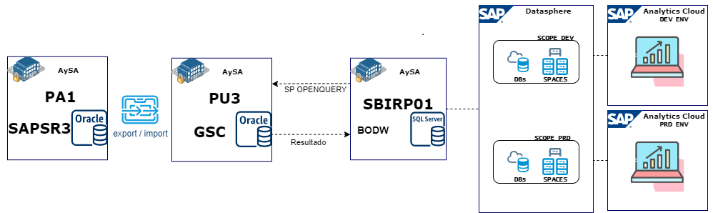

## Orígenes de Datos

Por una cuestión de permisos no se puede llegar directamente a la base comercial. El área de Base de datos de Oracle realiza un export de PA1 y un import en PU3 de las siguientes tablas: `BNKA, DFKKZK, FKKVKP, ZTOV_TIPOS_LOGS, ZTOVLOGS, ZTOVTIPOS_TRAMIT, ZTOVTRAMITES, ZTOVUSERS, ZTOVUSERS_CONT, ZTU_SOLIC_REG, ZTUDIST_REGION`. Se establecerá una conexión vía Linked Server desde SBIRP01 hacia la base comercial en Oracle y para el procesamiento de los SP en SBIRP01 contra Oracle se utilizará `OPENQUERY` .

La tabla de Logs que se usa para obtener datos sobre las consultas -ZTOVLOGS- contiene millones de registros. Se llevará a cabo una estrategia para normalizar y granularizar los registros. Aunque no es tan grande como ZTOVLOGS, para la tabla ZTOVTRAMITES se implementó la misma estrategia.

El uso de `OPENQUERY` permite que las consultas se ejecuten directamente en Oracle, lo que aprovecha el motor de Oracle para realizar el procesamiento pesado de los datos (filtros, agregaciones, joins) y así reducir el volumen de datos transferidos a SQL Server. Esto mejora el rendimiento, ya que Oracle está optimizado para manejar grandes volúmenes de registros como en las tabla ZTOVLOGS. Además, se minimiza la carga en SQL Server al recibir solo los resultados ya procesados y se evita la latencia y el uso excesivo de ancho de banda. Al realizar el procesamiento en Oracle, también se pueden aprovechar las optimizaciones propias del sistema, como el uso eficiente de índices y ajustes del plan de ejecución, mejorando el tiempo de respuesta y la eficiencia general en el manejo de consultas con grandes volúmenes de datos.

### Esquema general

### Schedule diario de cargas

- 06:10 - Export **-PA1-** / Import **-PU3-**
- 06:20 - Job_OV_ETL **-SBIRP01 BODW-**
- 06:30 - Persistencia Vistas **-DSP-**

### ETL BODW

#### p_OV_Carga_Adheridos_Factura_Digital_Diario

Este procedimiento sincroniza la tabla `OV_Adheridos_Factura_Digital_Diario` con datos de la tabla `GSC.FKKVKP` en Oracle. Los campos que trae de la tabla origen son la fecha de alta (`ZZFEALTA`) y la cantidad de registros (`VKONT`), y los guarda en los campos `Fecha_Alta` y `Cantidad` de la tabla destino.

Se filtra por un código de adhesión (`ZZCOD_ADHE = 'ZLSP'`) y por la fecha de alta mayor o igual a la última fecha registrada en la tabla destino, o desde el 01/01/2009 si no hay registros. Además, los datos se agrupan por `ZZFEALTA` para calcular las cantidades.

#### p_OV_Carga_Adhesion_PP_ECP

Este procedimiento sincroniza la tabla `OV_Adhesion_PP_ECP` con datos de la tabla `GSC.ZTU_SOLIC_REG` en Oracle. Los campos que trae son `ID_SOLICITUD`, `VKONT`, `ERDAT`, `NRO_ECP`, `TOTAL_DEUDA`, `CUOTAS`, y el correo encriptado (`MAIL`). Los guarda en los campos `ID`, `Cuenta_Contrato`, `Fecha_Generacion`, `Tipo`, `Nro_ID_PAG`, `Total_Deuda`, `Cuotas` y `Correo_Hash` de la tabla destino.

Se filtra por el estado (`STATUS`) y origen (`ORIGEN`) de la solicitud, y solo incluye registros donde el origen sea `'C'` con estado `'17'` o el origen sea `'P'` con estado `'09'`. Los datos se agrupan por contrato (`VKONT`) y se filtran a partir de la última fecha registrada en la tabla destino, o desde el 01/01/2009 si no hay registros.

#### p_OV_Carga_Cobros_Diario

Este procedimiento sincroniza la tabla `OV_Cobros_Diario` con datos de la tabla `DFKKZK` en Oracle. Se obtienen los campos `keyz1` (ID del medio), `BUDAT` (fecha de contabilización), el número de cobros (`anzpo`), y la suma de los montos (`SUMMS`). Estos datos se insertan o actualizan en los campos `ID_Medio`, `Fecha_Cobro`, `Cantidad_Cobros`, y `Total_Cobro` de la tabla destino.

El procedimiento primero busca la última fecha registrada en `OV_Cobros_Diario`. Si no hay registros, se utiliza la fecha base del 01/01/2006. A partir de esa fecha, se extraen los registros desde Oracle donde la fecha de contabilización (`BUDAT`) sea igual o posterior a esta.

Además, se excluyen registros específicos:

* Registros de remesas fiscales (`GSBER = BCOS`) donde el campo `ERNAM` sea distinto a 'Batchuser'.
* Registros donde el campo `GSBER` esté en blanco.

Los datos se agrupan por `ID_Medio` y `Fecha_Cobro`, y se comparan con la tabla de destino.

* Si ya existe un registro con el mismo `ID_Medio` y `Fecha_Cobro`, se actualiza el `Total_Cobro` y el `Cantidad_Cobros`.
* Si no existe, se inserta un nuevo registro.

#### p_OV_Carga_Cuentas_Totales_Diario

Este procedimiento sincroniza la tabla `OV_Cuentas_Totales_Diario` con datos de la tabla `GSC.ZTOVUSERS_CONT` en Oracle. Los campos que trae son `FECHA_ALTA` y el conteo de contratos (`CONTRATO`), y los guarda en los campos `Fecha_Alta` y `Cantidad` de la tabla destino.

Se filtra para incluir solo los registros donde la fecha de baja (`FECHA_BAJA`) sea igual a `'00000000'`, lo que indica que el usuario está activo, y donde la fecha de alta sea igual o mayor a la última fecha registrada en la tabla destino, o desde el 01/01/2009 si no hay registros. Los datos se agrupan por `FECHA_ALTA`.

#### p_OV_Carga_Cuentas_Unicas_Diario

Este procedimiento limpia la tabla `OV_Cuentas_Unicas_Diario` y luego la sincroniza con los datos de la tabla `GSC.ZTOVUSERS_CONT` en Oracle. Se obtiene el campo `CONTRATO` y su primera fecha de alta (`FECHA_ALTA`), almacenando en los campos `Fecha_Alta` y `Cantidad` en la tabla destino.

Se filtran los contratos que no tienen fecha de baja (`FECHA_BAJA = '00000000'`), y los datos se agrupan por la primera fecha de alta de cada contrato, utilizando una subconsulta (`WITH FirstLogins`).

#### p_OV_Carga_Distrito_Region

Este procedimiento sincroniza la tabla `OV_Distrito_Region` con datos provenientes de la tabla `GSC.ZTUDIST_REGION` en Oracle. Se utilizan los campos `ID_Distrito`, `ID_Region` y `Descripcion_Region` tanto en la tabla de origen como en la de destino.

Se actualizan las descripciones de región en la tabla destino cuando hay coincidencias en ambos IDs. Si no hay coincidencias, se insertan nuevos registros.

#### p_OV_Carga_Division

Este procedimiento sincroniza la tabla `OV_Division` con datos provenientes de la tabla `TGSBT` en Oracle. Los campos que se obtienen son `GSBER` (ID de la división) y `GTEXT` (Descripción de la división). Estos valores se insertan o actualizan en los campos `ID` y `Descripcion` de la tabla de destino.

El procedimiento ejecuta una consulta dinámica que extrae los datos de Oracle a través de `OPENQUERY`. Se filtran los registros para incluir solo aquellos donde el campo `MANDT` sea igual a '100'.

* Si ya existe un registro en `OV_Division` con el mismo `ID`, se actualiza la `Descripcion`.
* Si no existe un registro con ese `ID`, se inserta un nuevo registro con el `ID` y la `Descripcion` obtenidos de Oracle.

#### p_OV_Carga_Logs_Diarios

Este procedimiento sincroniza la tabla `OV_Logs_Diarios` (consultas) con datos de la tabla `GSC.ZTOVLOGS` en Oracle. Los campos que se extraen son `CREATEAT`, `OBJETO`, `Tipo`, `DISTRITO_USR`, y `Mobile`, que se guardan como `Fecha_Creacion`, `ID_Objeto`, `ID_Tipo`, `ID_Distrito`, `Origen` y `Cantidad` en la tabla destino.

Se filtra para incluir solo los registros donde la fecha de creación (`CREATEAT`) sea igual o mayor a la última fecha registrada en la tabla destino, o desde el 01/01/2024 si no hay registros. Los datos se agrupan por fecha, objeto, tipo, distrito y el origen (donde `Mobile` se transforma en `'App'` o `'Web'`).

#### p_OV_Carga_Medios_de_Pago

Este procedimiento sincroniza la tabla `OV_Medios_de_Pago` con datos de la tabla `bnka` en Oracle. Extrae los campos `bankl` como `ID` y `banka` como `Descripcion`.

La consulta filtra los registros para incluir solo aquellos donde `MANDT` sea `'100'` y `BANKL` sea diferente de `'123456'`. Si hay coincidencias en los IDs, actualiza la descripción en la tabla destino; si no hay coincidencias, inserta un nuevo registro.

#### p_OV_Carga_Tipo_Tramite

Este procedimiento sincroniza la tabla `OV_Tipo_Tramite` con datos de la tabla `GSC.ZTOVTIPOS_TRAMIT` en Oracle. Extrae los campos `TIPO` como `ID_Tipo`, `DESCRIPCION` como `Descripcion`, `DESCRIPCION_MAIL` como `Descripcion_Mail`, y `TIPOPED` como `Tipo_Ped`.

Si hay coincidencias en los IDs, actualiza la descripción, la descripción del correo y el tipo de pedido en la tabla destino. Si no hay coincidencias, inserta un nuevo registro.

#### p_OV_Carga_Tramites_Diarios

Este procedimiento sincroniza la tabla `OV_Tramites_Diarios` con datos de la tabla `GSC.ZTOVTRAMITES` en Oracle. Los campos que se extraen son `FECHA_ALTA`, `TIPO_SOLICITUD`, `DISTRITO`, `ESTADO`, `LOCALIDAD`, y la cantidad de solicitudes (`ID`). Estos se guardan en los campos correspondientes de la tabla destino.

Se filtra para incluir solo los registros donde la fecha de alta (`FECHA_ALTA`) sea igual o mayor a la última fecha registrada en la tabla destino, o desde el 01/01/2024 si no hay registros. Los datos se agrupan por fecha, tipo de solicitud, distrito, estado, localidad, y canal de origen (`ZCANAL`).

#### p_OV_Carga_Usuarios_Ultimo_Ingreso_Diario

Este procedimiento primero elimina todos los registros de la tabla `OV_Usuarios_Ultimo_Ingreso_Diario`. Luego, sincroniza esa tabla con datos de la tabla `GSC.ZTOVUSERS` en Oracle. Trae la fecha del último ingreso (`FECHA_ULT_ING`) y la cantidad de usuarios, guardándolos en los campos `Fecha_Ultimo_Ingreso` y `Cantidad` de la tabla destino.

Se filtra para considerar solo usuarios cuya fecha de alta no sea `'00000000'`. Si el último ingreso es igual a `'00000000'`, se reemplaza por una fecha base del 01/01/2009. Los datos se agrupan por la fecha del último ingreso.

#### p_OV_Carga_Usuarios_Unicos_Diario

Este procedimiento sincroniza la tabla `OV_Usuarios_Unicos_Diario` con datos de la tabla `GSC.ZTOVUSERS` en Oracle. Los campos que trae son la fecha de alta mínima (`FECHA_ALTA`) y el conteo de usuarios (`ID`), y los guarda en los campos `Fecha_Alta` y `Cantidad` de la tabla destino.

Se filtra para incluir solo los registros donde la fecha de alta sea válida (diferente de `'00000000'`) y sea igual o mayor a la última fecha registrada en la tabla destino, o desde el 01/01/2009 si no hay registros. Además, agrupa los datos por fecha de alta.

### ETL DSP

En Datasphere se utilizan vistas que luego se persisten para luego modelizar y poder explotar desde SAC:

#### VSF_Cobros_x_Medio

Esta consulta resume datos de cobros diarios provenientes de varias tablas relacionadas con medios de pago y divisiones. Utiliza la tabla `OV_Cobros_Diario` para obtener la información de los cobros, y se une con las tablas `OV_Medios_de_Pago` y `OV_Division` para obtener descripciones asociadas a los medios de pago y divisiones.

Los campos clave incluyen `Fecha_Cobro`, que se transforma en un formato `CALMONTH` (año y mes concatenados), y `ID_Medio`, que se utiliza para vincular las descripciones correspondientes. Se priorizan las descripciones de los medios de pago (`OV_Medios_de_Pago`), pero si no están disponibles, se usan las descripciones de divisiones (`OV_Division`), o en su defecto, el `ID_Medio` de la tabla principal.

La consulta agrupa los datos por el mes de cobro (`CALMONTH`) y el medio de pago o división, y calcula el total de cobros (`CantidadCobros`) y el monto total (`Total_Cobro`).

#### VSF_Contadores_OV

Este procedimiento consulta y resume datos de varias tablas relacionadas con usuarios y adheridos a la factura digital. Utiliza la tabla `SAP.TIME.VIEW_DIMENSION_DAY` para obtener las fechas y se une a tablas como `OV_Adheridos_Factura_Digital_Diario`, `OV_Cuentas_Totales_Diario`, `OV_Cuentas_Unicas_Diario`, `OV_Usuarios_Unicos_Diario` y `OV_Usuarios_Ultimo_Ingreso_Diario` para obtener la cantidad de adheridos, cuentas totales, cuentas únicas y usuarios únicos en las fechas correspondientes.

Los campos de las tablas origen incluyen `Fecha_Alta` para las cantidades y `Fecha_Ultimo_Ingreso` para determinar el tiempo desde el último ingreso, agrupando y filtrando las fechas entre el mínimo y máximo disponible en las tablas. También clasifica a los usuarios según su último ingreso en rangos de tiempo, desde "Nunca" hasta "Más de 6 meses". La información se presenta de forma que se pueda analizar fácilmente.

#### VSF_Consultas_Diarias

Este procedimiento realiza una consulta sobre los logs diarios almacenados en `DW_CENTRAL_DEV.OV_Logs_Diarios`. Se une a dos tablas: `OV_Distrito_Region`, para obtener la descripción de la región correspondiente a cada distrito, y `OV_Param_Objeto`, que incluye información sobre los parámetros de los objetos registrados.

La consulta agrupa los resultados por la fecha de creación, la consulta de los parámetros y la descripción de la región, junto con el origen del registro. Finalmente, suma la cantidad de registros para cada grupo, lo que permite conocer cuántas entradas hay para cada combinación de fecha, consulta y región.

#### VSF_Tramites_Diarios

Esta consulta se encarga de recopilar información sobre los trámites diarios desde la tabla `DW_CENTRAL_DEV.OV_Tramites_Diarios`. Se une con varias tablas para obtener detalles adicionales:

- **Tipo de Trámite:** Para incluir la descripción del tipo de trámite a través de `OV_Tipo_Tramite`.
- **Región:** Para obtener la descripción de la región mediante `OV_Distrito_Region`.
- **Estado del Trámite:** Para incluir la descripción del estado del trámite utilizando `OV_Tramite_Estado`.

Los resultados se agrupan por la fecha de alta, la descripción del tipo de trámite, el origen del trámite, la región y el estado. Finalmente, se suma la cantidad de trámites para cada grupo, permitiendo ver cuántos trámites se realizaron en cada combinación de estos criterios.