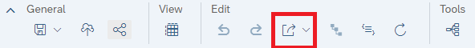
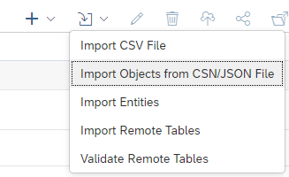
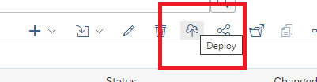
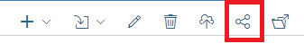
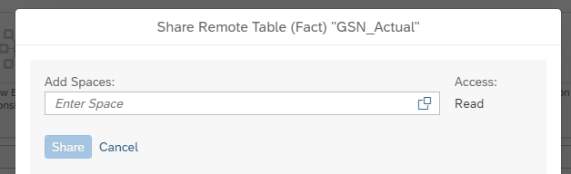

## Carpetas organizadoras
Para una mejor organización de tablas según origen, los espacios centrales tendrán subdivisiones por carpetas que representen este origen.

Las tablas importadas de un origen deben hacerse desde la carpeta correspondiente. Si la carpeta no esta creada deberá crearse según lo informado en el pasaje.

## Time Tables
Todos los espacios deben contar con sus tablas de tiempo. En caso de no existir deberán generarse desde el Space Management.

## Conexiones
Las conexiones son propias de cada espacio central.  El espacio DW Central (DEV) contendrá las conexiones utilizadas por los espacios de desarrollo mientras que DW Central (PRD) hará lo mismo con los espacios productivos.

Se recomienda utilizar el mismo nombre de conexión en ambos espacios centrales para evitar tener que modificar luego los objetos exportados en CSN/JSON.

## Tablas Remotas
Las tablas remotas son creadas e importadas en el espacio central de desarrollo. Luego es exportada ingresando al objeto de la tabla remota se encuentra la opción de exportar dentro de Edit:

Luego en el espacio central productivo se importa el objeto:

Debe realizarse el deploy de la tabla importada para incorporar los datos y dejarla en funcionamiento.

## Share
Finalmente debe realizarse el Share de la tabla con el espacio correspondiente donde se trabajaran las vistas y modelos:

## Schedule
La importación no incluye el Schedule de importación de la tabla. La cual debe crearse nuevamente respetando lo configurado en el espacio de desarrollo o lo que se defina en el pasaje (tener en cuenta horario UTC).

## Vistas
Se exportan de la misma manera  y desde el mismo menú que las tablas remotas. Dentro del CSN/JSON se encuentra la referencia a las tablas de las cuales consumen. La referencia es al nombre técnico (en el ejemplo es GSN_Actual$).

Dentro del CSN/JSON debe reemplazarse toda referencia al espacio central de desarrollo DW_CENTRAL_DEV por su referencia productiva DW_CENTRAL_PRD .

Se importan de la misma manera y desde el mismo menú que las tablas remotas. Finalmente debe realizarse el deploy de la vista para dejarla en funcionamiento.

## Modelo Analítico
Se tratan de la misma manera que las vistas teniendo el recaudo de modificar referencias a tablas compartidas desde otro espacio si fuera necesario.

Los modelos analíticos de los espacios de desarrollo tienen el prefijo DEV y los modelos analíticos de los espacios productivos PRD.