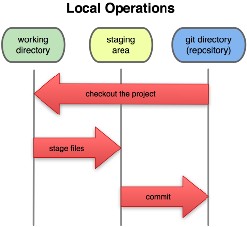

# Git

## Índice
* [¿Que es un control de versiones?](#version_control)
* [Git](#git_def)
* [Comandos Básicos](#basic_commands)

---

## <a name="version_control"></a>¿Que es un control de versiones?

Un Control de Versiones no es más que una herramienta para facilitar el desarrollo de Software tanto entre equipos como individuales. 

Nos va a permitir: 
* Llevar un seguimiento de la evolución de nuestro Software 
* Poder versionar nuestro Software. 
* Colaborar sobre una misma base de código, sin tener que copiar y pegar entre equipos 
* Los que llevéis más tiempo en el mundo del desarrollo software quizá hayáis usado ya subversion u otra herramienta de control de versiones centralizado. 
* En un control de versiones centralizado, todo el versionado se hace en una máquina que digamos que contiene la única “fuente de verdad”. El servidor que contiene el control de versiones establece el grado de acceso que tiene cada usuario, y las acciones que puede realizar ( sólo lectura / lectura y escritura). 
* La clave para diferenciar un CVCS respecto a un control de versiones distribuido como Git, es que toda la historia y todo el versionado se hace en el servidor. Si dicho servidor fallara , y no se tuviera respaldo de todo lo anterior, se perdería todo el histórico de cambios. 
* En cambio , en Git , cuando accedes a un repositorio mediante clone , te estás descargando unsnapshot de todo el repo con toda su historia hasta el momento en el que lo estás descargando. Podríamos verlo como que el servidor es una copia de respaldo , y toda la gente que trabaja en ese repositorio , va “sincronizando” esos cambios poco a poco, además de poder trabajar sin necesidad de conexión , ya que toda la actividad sobre la copia que tengamos es local, y no se perdería nada.

--- 

## <a name="git_def"></a>Git

Git es un sistema de control de versiones distribuido, de código abierto y multiplataforma. Fue impulsado por Linus Torvalds y el equipo de desarrollo del Kernel de Linux. Git nos ofrece las mejores características en la actualidad, pero sin perder la sencillez y no ha parado de crecer y de ser usado por más desarrolladores en el mundo. A los programadores nos ha ayudado a ser más eficientes en nuestro trabajo, ya que ha universalizado las herramientas de control de versiones del software que hasta entonces no estaban tan popularizadas y tan al alcance de los desarrolladores.

### Estados

Vamos a diferenciar 3 estados por los que pasa un fichero cuando está bajo un control de versiones git.

#### Git Directory

Cuando nos traemos por primera vez un repositorio a nuestro ordenador ( git clone ) o bien iniciamos un un nuevo repositorio ( git init ), lo que estamos haciendo es crear un directorio oculto.git donde se van a almacenar todos los metadatos y actividad de los cambios que haya en esa carpeta.

#### Working Directory

El directorio de trabajo no es más que una copia de la versión más reciente almacenada en la “base de datos de git” y expuesta en el sistema de ficheros para que podamos trabajar con ella de forma transparente.

#### Stagging Area

El área de preparación es un archivo contenido en tu directorio git , en el que se almacena toda la información que va a llevar nuestra nueva versión (Qué ficheros se han añadido, modificado o borrado). El área de preparación es el preludio de un commit.



# <a name="basic_commands"></a>Comandos Básicos

* **git config**: Uno de los comandos más usados en git es git config, que puede ser usado para establecer una configuración específica de usuario, como sería el caso del email, un algoritmo preferido para diff, nombre de usuario y tipo de formato, etc… 
```bash
Por ejemplo, el siguiente comando se usa para establecer un email:
git config --global user.email sam@google.com
```
* **git init**: Este comando se usa para crear un nuevo repertorio GIT:
```bash
git init
```
* **git add**: Este comando puede ser usado para agregar archivos al index. 
```bash
Por ejemplo, el siguiente comando agrega un nombre de archivo temp.txt en el directorio local del index:
git add temp.txt
```
* **git clone**: Este comando se usa con el propósito de revisar repertorios. 
```bash
Si el repertorio está en un servidor remoto se tiene que usar el siguiente comando:
git clone alex@93.188.160.58:/path/to/repository
Pero si estás por crear una copia local funcional del repertorio, usa el comando:
git clone /path/to/repository
```
* **git commit**: El comando commit es usado para cambiar a la cabecera. Ten en cuenta que cualquier cambio comprometido no afectara al repertorio remoto. 
```bash
Usa el comando:
git commit –m “Message to go with the commit here”
```
* **git status**: Este comando muestra la lista de los archivos que se han cambiado junto con los archivos que están por ser añadidos o comprometidos.
```bash
git status
```
* **git push**: Este es uno de los comandos más básicos. Un simple push envía los cambios que se han hecho en la rama principal de los repertorios remotos que están asociados con el directorio que está trabajando. 
```bash
Por ejemplo:
git push origin master
```
* **git checkout**: El comando checkout se puede usar para crear ramas o cambiar entre ellas. 
```bash
Por ejemplo, el siguiente comando crea una nueva y se cambia a ella:
git checkout -b <banch-name>
Para cambiar de una rama a otra solo usa:
git checkout <branch-name>
```
* **git remote**: El comando git se usa para conectar a un repositorio remoto. 
```bash
El siguiente comando muestra los repositorios remotos que están configurados actualmente:
git remote -v
Este comando te permite conectar al usuario con el repositorio local a un servidor remoto:
git remote add origin <93.188.160.58>
```
* **git branch**: Este comando se usa para listar, crear o borrar ramas. 
```bash
Para listar todas las ramas se usa:
git branch
para borrar la rama:
git branch -d <branch-name>
```
* **git pull**: Para poder fusionar todos los cambios que se han hecho en el repositorio local trabajando, el comando que se usa es:
```bash
git pull
```
* **git merge**: Este comando se usa para fusionar una rama con otra rama activa:
```bash
git merge <branch-name>
```
* **git diff**: Este comando se usa para hacer una lista de conflictos. 
```bash
Para poder ver conflictos con el archivo base usa:
git diff --base <file-name>
El siguiente comando se usa para ver los conflictos que hay entre ramas que están por ser fusionadas para poder fusionarlas sin problemas:
git diff <source-branch> <target-branch>
Para solo ver una lista de todos los conflictos presentes usa:
git diff
```
* **git tag**: Etiquetar se usa para marcar commits específicos con asas simples. 
```bash
Por ejemplo:
git tag 1.1.0 <instert-commitID-here>
```
* **git log**: Ejecutar este comando muestra una lista de commits en una rama junto con todos los detalles. 
```bash
Por ejemplo:

commit 15f4b6c44b3c8344caasdac9e4be13246e21sadw

Author: Alex Hunter <alexh@gmail.com>
Date: Mon Oct 1 12:56:29 2016 -0600
```
* **git reset**: Para resetear el index y el directorio que está trabajando al último estado comprometido se usa este comando:
```bash
git reset --hard HEAD
```
* **git rm**: Este comando se puede usar para remover archivos del index y del directorio que está trabajando:
```bash
git rm filename.txt
```
* **git stash**: Este es uno de los comandos menos conocidos, pero ayuda a salvar cambios que no están por ser comprometidos inmediatamente, pero temporalmente:
```bash
git stash
```
* **git show**: Se usa para mostrar información sobre cualquier objeto git. 
```bash
Por ejemplo:
git show
```
* **git fetch**: Este comando le permite al usuario buscar todos los objetos de un repositorio remoto que actualmente no reside en el directorio local que está trabajando. 
```bash
Por ejemplo:
git fetch origin
```
* **git ls-tree**: Para ver un objeto de árbol junto con el nombre y modo de cada uno de ellos, y el valor blob´s SHA-1, se usa:
```bash
git ls-tree HEAD
```
* **git cat-file**: Usando el valor SHA-1, se puede ver el tipo de objeto usando este comando. 
```bash
Por ejemplo:
git cat-file –p d670460b4b4aece5915caf5c68d12f560a9fe3e4
```
* **git grep**: Este comando le permite al usuario buscar en los árboles de contenido cualquier frase o palabra. 
```bash
Por ejemplo, para buscar por www.tupaginaweb.com en todos los archivos se usaría:
git grep “www.tupaginaweb.com”
```
* **gitk**: Este es la interfaz gráfica para un repositorio local que puede invocar escribiendo y ejecutando:
```bash
gitk
```
* **git instaweb**: Con este comando un servidor web puede correr interconectado con el repositorio local. 
```bash
Un navegador web también está automáticamente dirigido a el:
git instaweb –http=webrick
```
* **git gc** Para optimizar el repositorio por medio de una recolección de basura, que limpiara archivos innecesarios y los optimizara, usa:
```bash
git hc
```
* **git archive**: Este comando le permite al usuario crear archivos zip o tar que contengan los constituyentes de un solo árbol de repositorio:
```bash
git archive – -format=tar master
```
* **git prune**: Con este comando los objetos que no tengan ningún puntero entrante serán eliminados:
```bash
git prune
```
* **git fsck**: Para poder hacer un chequeo de integridad del sistema de archivos git, usa este comando. Cualquier objeto corrompido será detectado:
```bash
git fsck
```
* **git rebase**: Este comando se usa para la re aplicación de los compromisos en otra rama. 
```bash
Por ejemplo:
git rebase master.
```

--- 

[Fuente](https://gitlab.itg.es/public-projects/devops/-/blob/b092f61972ed3e0e870df480a8f7588778678ac0/documentation/tutorial/3-git.md)