## Creación de tablas de tiempo dentro del Espacio

- Dentro de Space Management, en la sección Time Data crear las tablas (solo se debe elegir el Rango de Tiempo x ej: 2000-2050):

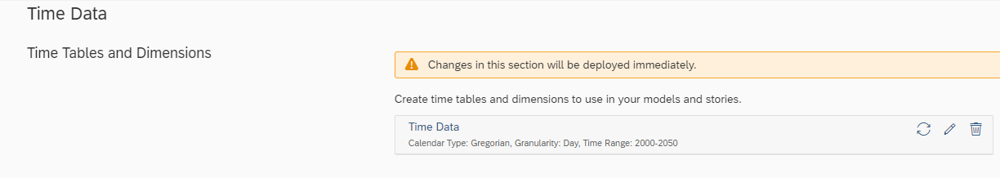

- Dentro del Data Builder se ve que las tablas se crearon y agregaron al espacio:

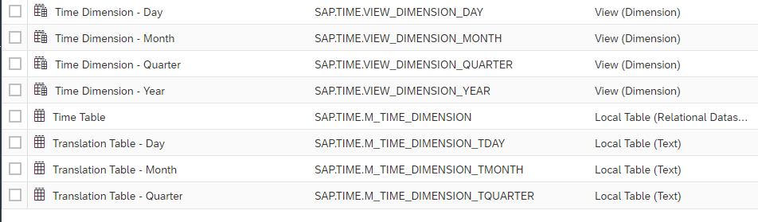

## Importación de tablas remotas

- Dentro del Data Builder (con la precondición de que se haya creado la conexión con la BBDD -en este caso con la Replica de Máximo en SBIRP01-) dentro del Espacio se puede importar la tabla remota:
- 
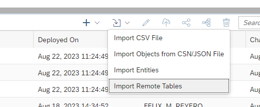

- Se selecciona la conexión, se eligen las tablas, se importa y se despliega.

## Conversión de datos Timestamp a Date a través de Vista intermedia

- Una vez importadas las tablas, en caso de tener datos en formato Timestamp se deberá crear una vista intermedia para poder castear y asociar estos datos a formatos de tiempo que luego nos permitan trabajar con ellos de manera directa:

- Si la vista luego tiene que ser utilizada desde un Analytic Model debe ser configurada como Fact en el Semantic Usage:

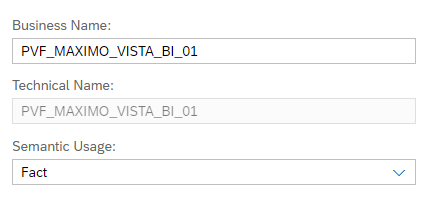

- Se importa la tabla en la vista y se crean Calculated Columns para el casteo:

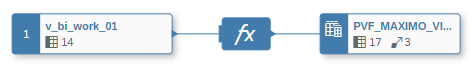
- Por cada fecha que se debe castear se crea una Calculated Column con Data Type “Date” y la función “TO_DATE(campo)”:

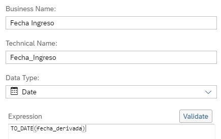

- Si es de tipo String hay que definir bien el formato: 

`TO_DATE('19082021', 'DDMMYYYY')`

- Workaround para fechas feas: 

`CASE "Fecha de solución" WHEN 'Sin solución' THEN NULL ELSE TO_DATE("Fecha de solución", 'DD/MM/YYYY')  END`

```
TO_TIMESTAMP(
  LPAD(TO_NVARCHAR(ID_ANO), 4, '0') ||
  LPAD(TO_NVARCHAR(ID_MES), 2, '0') ||
  LPAD(TO_NVARCHAR(ID_DIA), 2, '0') || ' ' ||
  TO_NVARCHAR(HORA), 'YYYYMMDD HH24:MI:SS'
)
```

- Luego la Calculated Column se debe asociar al campo de fecha que generamos para el espacio creando una Association por cada una:

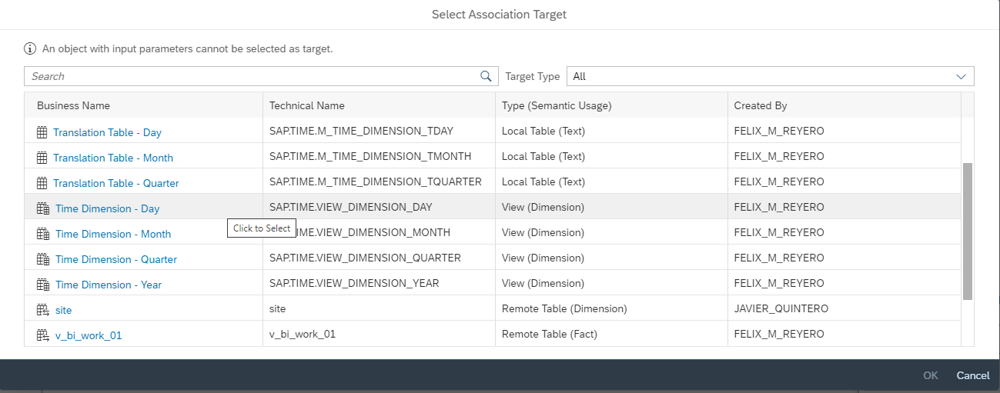

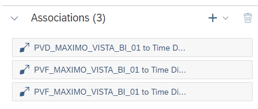

- Una vez seleccionada la “Time Dimmension - Day” se debe mapear el campo nuestro (timestamp) al Date. Se debe generar uno por cada fecha a castear:
 
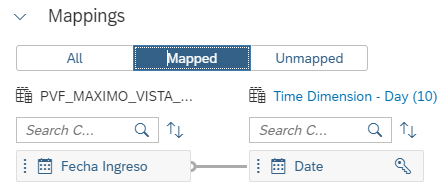

## Uso de la vista intermedia en el Analytic Model

- Crear un Analytic Model y arrastrar la vista creada desde el repositorio. Elegir todas las dimensiones asociadas para tener las fechas casteadas e importar:

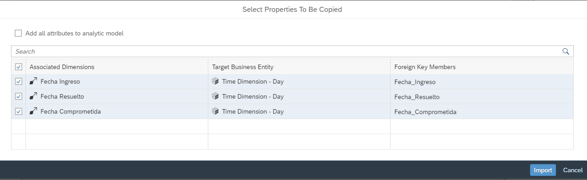

- Generar un Measure cualquiera (un distinct sirve), hacer Preview y se pueden ver las fechas en acción:

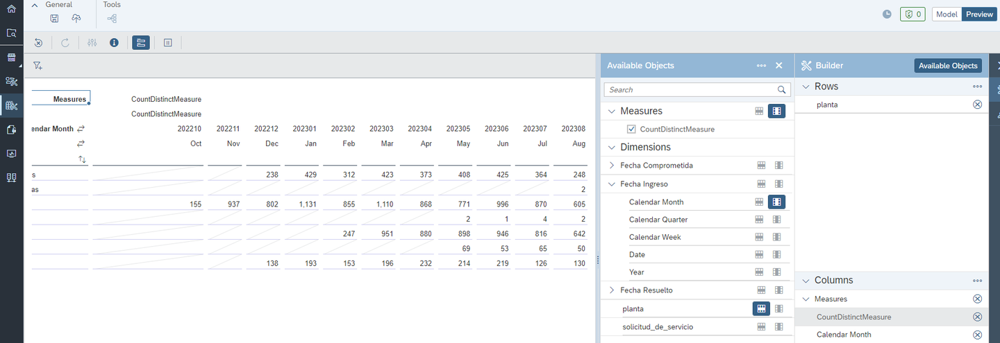